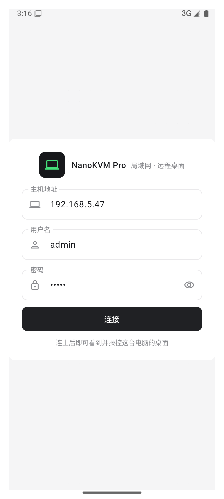
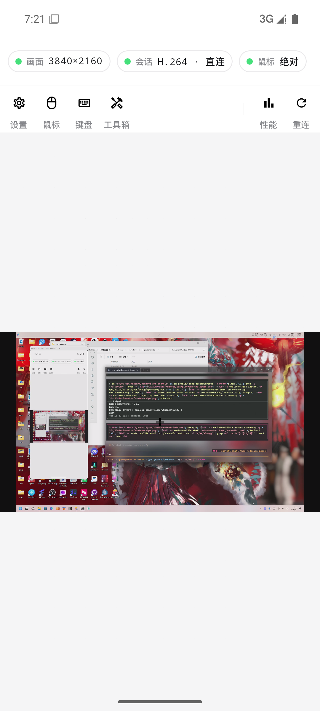
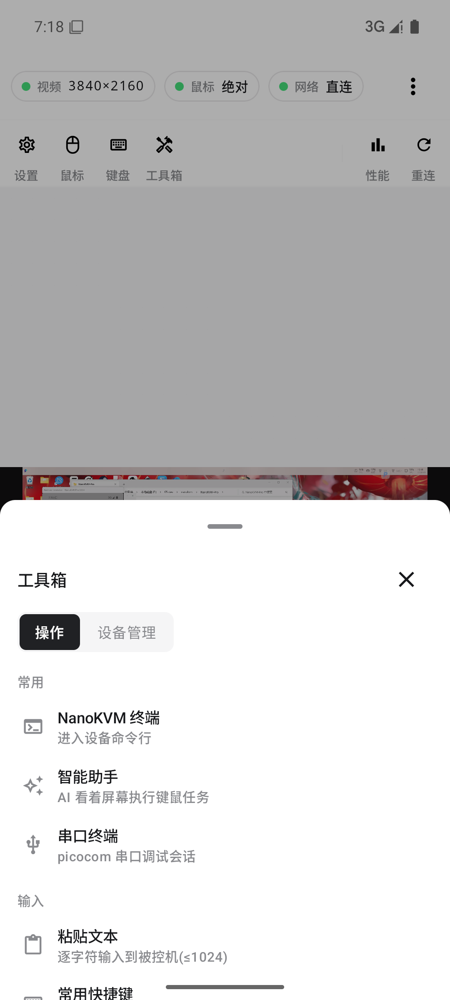
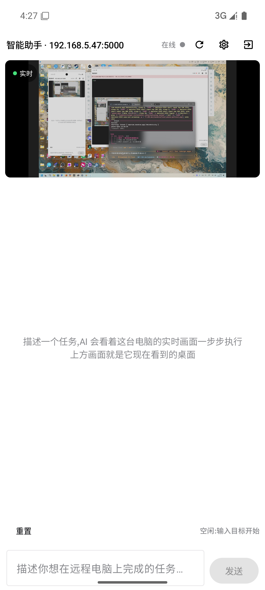
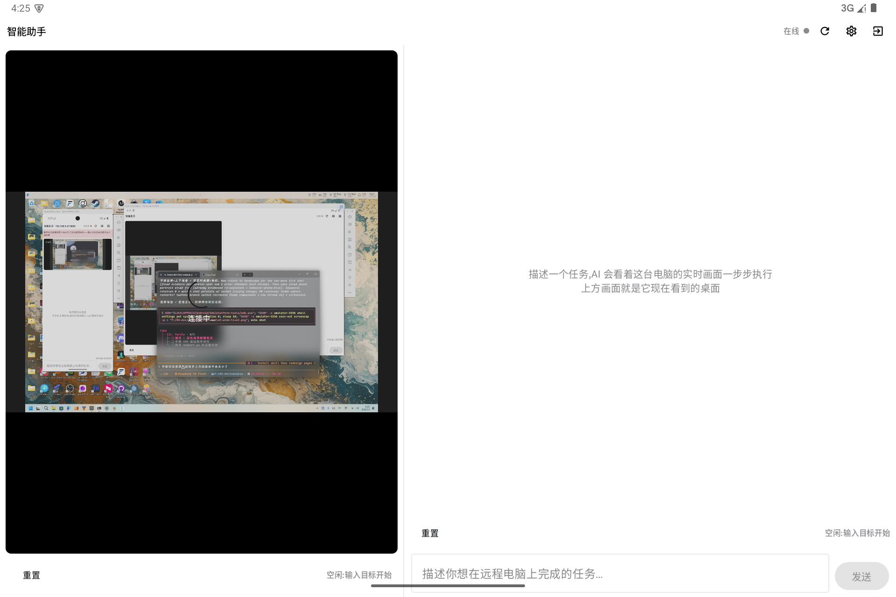
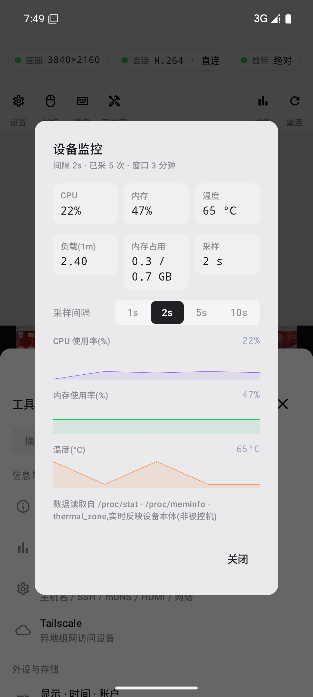
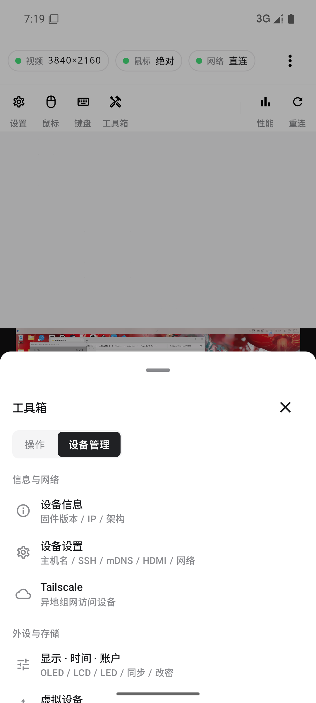
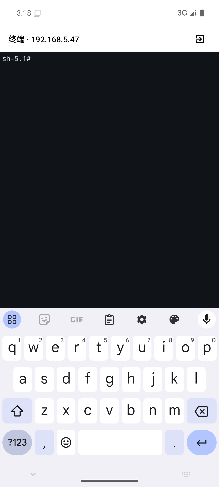
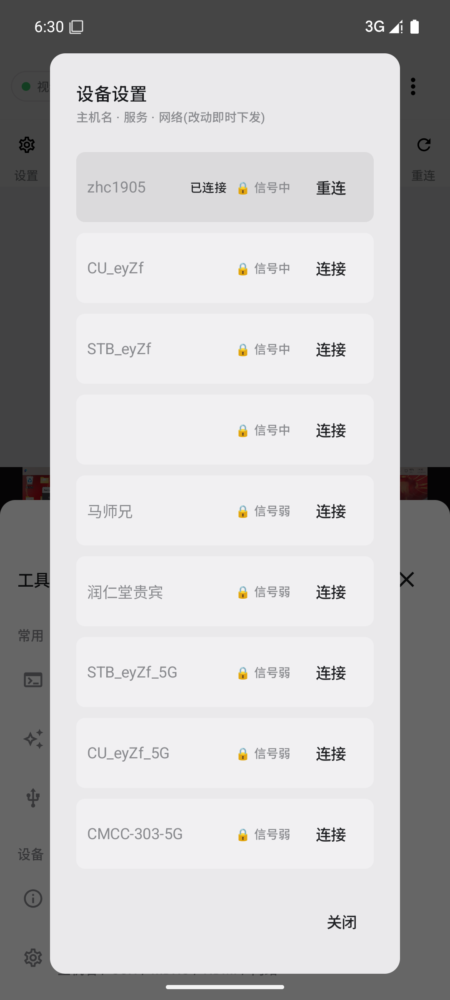

# NanoKVM-Pro Android 客户端

NanoKVM-Pro(开源 KVM over IP 设备)的非官方 Android 客户端 —— 在手机上随时看、控、管你那一台不在身边的电脑。

> 设备端固件见 [sipeed/NanoKVM](https://github.com/sipeed/NanoKVM)(本客户端对接其 NanoKVM-Pro API 与 WebSocket 协议)。

## 功能一览

### 远程桌面(核心)
- 四种传输:**H.264/H.265 × 直连/WebRTC**,画面/鼠标双通道分离,断线指数退避自动重连
- 3840×2160 4K 渲染;旋转 0/90/180/270、缩放 50–200%(直连路径)
- 触屏鼠标(绝对/相对)、双击右键、双指滚轮;虚拟键盘 + 常用快捷键(Ctrl+Alt+Del 等)
- 诊断面板:码率/帧率/解码延迟/抖动缓冲/ICE RTT/丢包,实时曲线(uPlot 风格)

### 智能助手(设备端 AI,cua)
- App 内对话,无需开浏览器:AI 看着被控机实时画面执行键鼠任务
- **实时桌面缩略图**(MJPEG 直播流,平板横屏大画面、竖屏/手机自适应条带)
- 任务控制(暂停/重置/继续)、OpenAI 兼容模型设置、每轮思考/动作/截图气泡
- **会话接管**:单用户会话被占用时,一键从客户端接管(杀旧起新),无需重启设备

### 工具箱(操控与设备管理分页)
- 操作:终端(root shell)/串口/粘贴/快捷键/码率·帧率·GOP/鼠标/电源键
- 管理:设备信息/设备设置(主机名·SSH·mDNS·HDMI·静态IP·WiFi)/显示·时间·账户/虚拟设备/Tailscale/系统更新/EDID·镜像(上传·分片·校验)/脚本/WOL
- **设备监控**:CPU/内存/温度/负载,2s 采样 + 固定窗口滚动曲线(间隔可调)

### 自适应
- 手机竖屏上下堆叠;平板横屏左右双栏(实时画面 + 对话/控制);深/浅色主题跟随系统

## 截图

| 连接 | 主控台(状态三 chip) | 工具箱-操作 |
|---|---|---|
|  |  |  |

| 助手(手机竖屏) | 助手(平板横屏双栏) | 设备监控 |
|---|---|---|
|  |  |  |

| 工具箱-设备管理 | 终端 | Wi-Fi 扫描 |
|---|---|---|
|  |  |  |

## 构建

```bash
# Android Studio 直接打开 ./ 即可;或命令行:
./gradlew :app:assembleDebug
adb install -r app/build/outputs/apk/debug/app-debug.apk
```

- JDK 17 / Gradle 8.11.1(已钉 wrapper)/ AGP 8.7.3 / Kotlin 2.0.21
- 设备自签 HTTPS 由 App 内 trust-all(仅 MVP、局域网场景)处理;Manifest `usesCleartextTraffic=true` 仅为助手服务(http://host:5000)

## 使用

1. 连接页填入设备地址与 Web 管理员账号(如 `192.168.5.47` / `admin`)
2. 连接后即可触屏操控;顶部三颗状态:画面(分辨率)/会话(编码·传输)/鼠标(模式)
3. 智能助手:工具箱 → 智能助手 → 启动并进入对话(首次需在设备端安装依赖,见设备 Web 说明)
4. 设备管理类功能集中在 工具箱 →「设备管理」页

## 说明

- 非官方客户端,基于 NanoKVM-Pro 开放 API 开发;仅供学习与个人使用
- 助手视觉模型走 OpenAI 兼容端点,密钥存于设备端 `/etc/kvm/cua_cfg.json`
- 远程操控/断电/改密等危险操作 App 内均带二次确认

## 致谢

- [NanoKVM](https://github.com/sipeed/NanoKVM)(协议与固件)
- Web 端交互语义大量参考 NanoKVM Web UI
